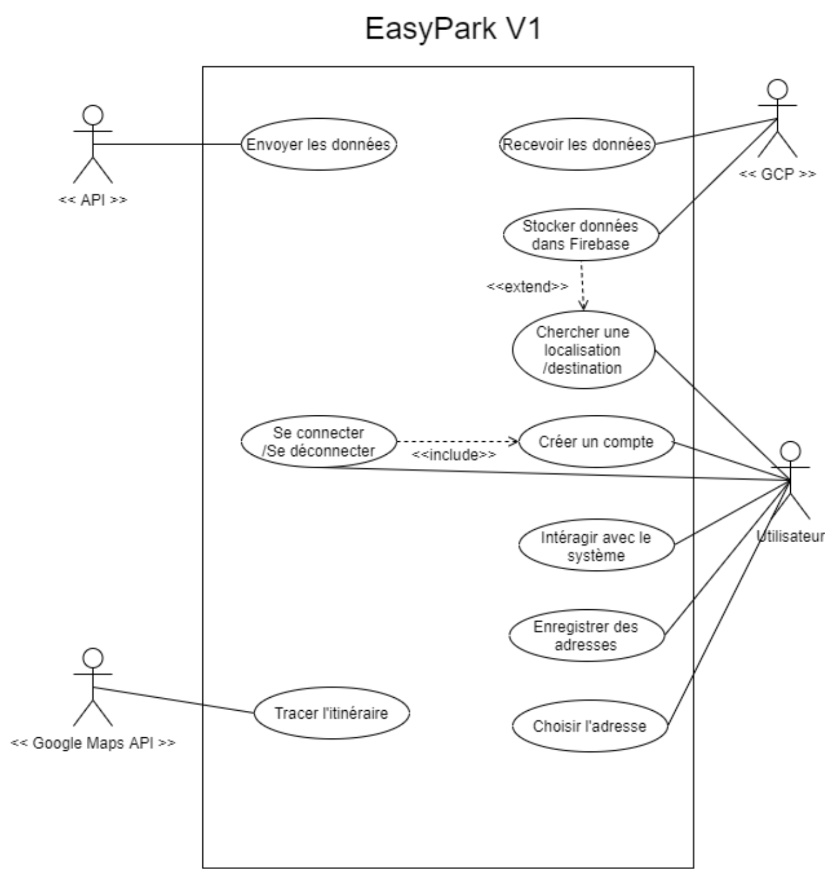
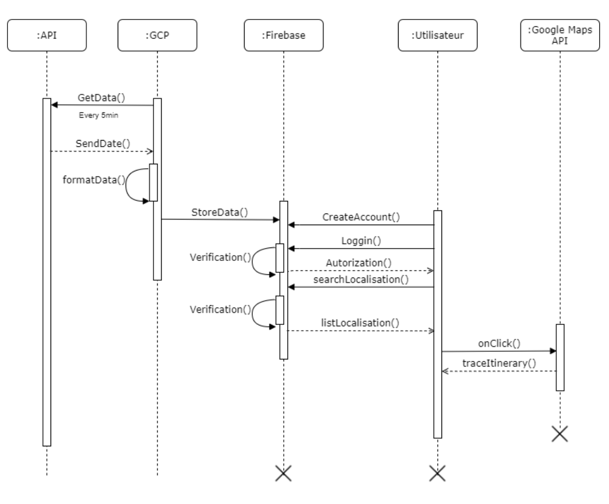

# EasyPark
## 1. Le contexte du projet
   Dans le cadre de L’UE projet thématique pour l’obtention du MASTER CCM nous proposons un projet qui réponds aux spécifications suivant: Cloud et Mobilité
## 2. La problématique
   Permettre aux utilisateurs de trouver une place de parking disponible proche de leur destination ou localisation. Ce besoin est répandu spécialement dans les grandes villes.
## 3. La solution de cette dernière
   Nous allons, dans un premier temps pour l’échéance de décembre, mettre en place les jeux de données de place de parking venant de data.gouv.fr à une base firebase et la lier à notre application mobile en kotlin.
   Dans un deuxième temps, pour notre deuxième livrable, nous prévoyons d’étendre le champ de l’application avec des prédictions venant non seulement des jeux de données mais aussi de nos données provenant de nos utilisateurs.
## 4. Solution existant
   Plusieur app existent déjà pour la gestion de parking comme https://flowbird.fr/parking-solutions/, https://www.opngo.com/fr et d’autre mais leur objectif principale est de faciliter le stationnement après trouver une place comme facilités de paiement et alerte sur l'expiration du ticket. La disponibilité reste la problématique principale de notre et avec la solution cloud on joueras sur la perf et la récupération de données (pour arriver à un traitement en real time).
## 5. Gestion de projet
   Après validation du projet on propose une gestion de projet par sprint et objectif en utilisant la méthode agile celà en respectant les dates de livrable qui sera mensuel pour que vous puissiez suivre notre avancement, pour ça on vous invite sur notre outil de gestion https://www.pivotaltracker.com/. l’organisation de notre git sera basée sur ces tickets par branche.

## 6. La modélisation d’utilisation 

### ● Diagramme de cas d’utilisation:

### ● Diagramme de séquence:

 
 